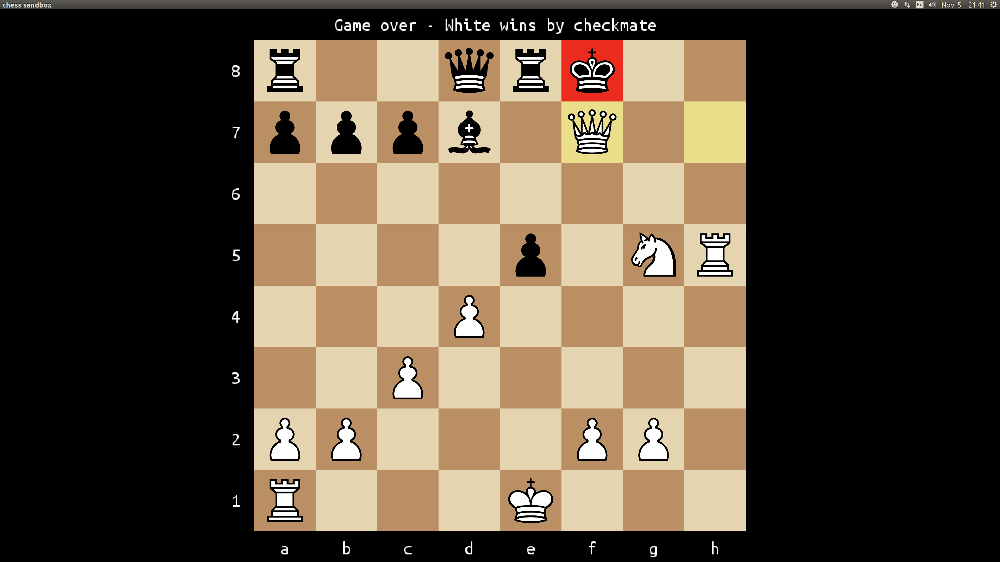

# chess:
My (UNFINISHED) solution to the [final exercise of the Ruby Programming Unit](https://www.theodinproject.com/courses/ruby-programming/lessons/ruby-final-project), from the Odin Project.

The instructions, in a nutshell, are to build a "... command line chess game where two players can play against each other. The game should be properly constrained."

I chose not to produce a command line app, but instead went for a more graphical approach, using the ruby2D gem. While this gem is still a little rough around the edges (at only v 0.7), it is way more pleasant to look at than anything I could produce in a terminal, and enables a much more user-friendly interface (with a little more work). So far, I have been very impressed with the ease-of-use of this gem.

Current state (05/11/18): Pieces constrained to legal moves, including the effects of pins and check (both single and double-check). All legal moves are possible, including castling, pawn promotion and en-passant. Checkmate and stalemate are correctly detected (and the game halted when found).

Draws by 50-move-rule (no captures or pawn moves) or 3-fold repetition of position are enforced (though officially should be claimed by a player, so I may change this to an advisory message, with an option to claim the draw).

A move list (both native and PGN format) is created as a game progresses. The piece that moved is disambiguated in PGN format, when needed (e.g. 'Nbd7', rather than simply 'Nd7'). Checks, checkmate, stalemate, en-passant and pawn promotion are all correctly formatted in the PGN record.

Legal moves, if any, are highlighted (green squares) when a piece is 'lifted'. A 'ghost' piece remains on the originating square while a piece is 'lifted'. The king's square is highlighted (red) if in check (or checkmate). The last move originating and final squares are highlighted (yellow). On pawn promotion, the player is presented with a choice of Queen, Rook, Bishop, or Knight (click-able).

### To do next:
  * draw by insufficient material
  * draw by 3-fold-repetition
  * flippable board

Note: At the moment, to run this (after downloading this repository), you'll need Ruby installed. Then, open a terminal, navigate to the root folder of the downloaded repository, and enter; <code>ruby chess.rb</code>

### Features I want to add:
  * file ui, for saving / loading of both unfinished and finished games, in both app native and PGN formats.
  * step back / fwd through game (in progress, or completed)
  * ui niceties (e.g. coordinates on/off, piece points count, etc.)
  * Try doing more than just an 'AI' that plays a random move (as suggested in the 'Optional Extension'), but instead use a brute force look-ahead of a few ply (will still be an awful opponent!).
  * distributable executable (at least for Linux and OSX)

### Resources used:

  * [Chess Mérida](https://marcelk.net/chess/pieces/merida/320/): Freeware. True Type Font, by Armando H. Marroquin, for diagrams and figurine notation.
  * [ruby2D gem](http://www.ruby2d.com/learn/get-started/): Tom Black: This entire project is open source under the MIT license.
  * [Ubuntu Fonts](https://design.ubuntu.com/font/): The licence allows the licensed fonts to be used, studied, modified and redistributed freely (providing certain conditions are met).
