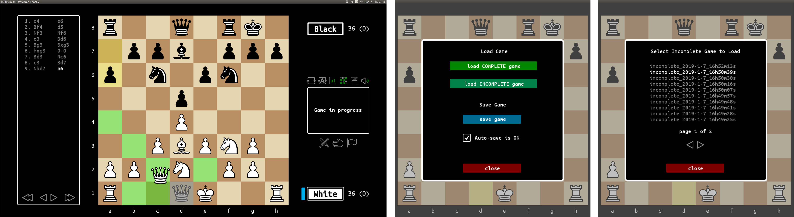

# chess:
My (UNFINISHED) solution to the [final exercise of the Ruby Programming Unit](https://www.theodinproject.com/courses/ruby-programming/lessons/ruby-final-project), from the Odin Project.

The instructions, in a nutshell, are to build a "... command line chess game where two players can play against each other. The game should be properly constrained."

I chose not to produce a command line app, but instead went for a more graphical approach, using the Ruby2D gem. While this gem is still a little rough around the edges (at only v 0.7), it is way more pleasant to look at than anything I could produce in a terminal, and enables a much more user-friendly interface (with a little more work). So far, I have been very impressed with the ease-of-use of this gem.

### Current state (9/12/18):

Pieces constrained to legal moves, including the effects of pins and check (both single and double-check). All legal moves are possible, including castling, pawn promotion and en-passant. Checkmate, stalemate, and draw due to insufficient material, are correctly detected (and the game halted when found).

Draw conditions due to 50-move-rule (no captures or pawn moves) or 3-fold repetition of position are detected and an option to claim the draw is presented. A draw can also be agreed manually, or declined by playing a move after a draw offer is made. The side to move can choose to resign.

A move list (both native and PGN format) is created as a game progresses. The piece that moved is disambiguated in algebraic notation, when needed (e.g. 'Nbd7', rather than simply 'Nd7'). Check, checkmate, piece capture, win, draw, en-passant and pawn promotion are also correctly formatted (in algebraic notation) in the PGN record.

### UI features implemented:
  * highlighting of legal move squares, if any, (green squares) when a piece is lifted
  * highlighting of king in check / checkmate (red square)
  * highlighting of last move (yellow squares: start-square & end-square)
  * pawn promotion menu: click-able choice of Q, R, N, or B.
  * side to move indicator
  * total pieces value (and difference) for each side - updates when piece taken / pawn promoted
  * information box: 'game in progress'; checkmate, stalemate and draw advice, etc.
  * advice + 'claim draw' option  when 3-fold-repetition / 50-move-rule conditions satisfied
  * draw by agreement - click to 'agree' or play on to decline
  * resign option - click to confirm or play on to cancel
  * flip board (and related UI elements + promotion menu, if displayed)
  * auto-flip - board flips to side to move, after every move
  * disable / enable coordinates
  * disable / enable highlighting of legal move squares
  * button hover effects and tool-tips
  * algebraic notation display
  * review of game moves (step fwd/back, go to start/end)

### To do next:
  * add sound effects
  * load / save game
  * engine (very simple, probably with poor play) v human

Note: At the moment, to run this (after downloading this repository), you'll need Ruby installed. Then, open a terminal, navigate to the root folder of the downloaded repository, and enter; <code>ruby chess.rb</code>

### Features I want to add:
  * file ui, for saving / loading of both unfinished and finished games, in both app native and PGN formats.
  * Try doing more than just an 'AI' that plays a random move (as suggested in the 'Optional Extension'), but instead use a brute force look-ahead of a few ply (will still be an awful opponent!).
  * distributable executable (at least for Linux and OSX)

### Ruby2D issues & workarounds:
  Ruby2D seems to make great use of CPU to display elements:

  * shape objects use significantly more CPU than text (counter-intuitive)
  * using .add / .remove to show / hide is 10x slower than using z-axis (and hiding behind other graphic object(s)), but completely avoids the CPU hit otherwise incurred, without removing reference(s) to object instance(s)

  Thus, I replaced as many shape object instances, (64 squares to create a board image, for example), and some collections of text object instances, with .png images, and used .remove / .add wherever possible (rather than 'hiding' items using the z-axis). I will also rewrite the move list display method to concatenate text wherever possible into single lines (rather than each line being composed of three text instances).

  * text objects have poor anti-aliasing, which can result in a 90's style pixelation
  * text objects seem to be limited to single-line strings
  * creating 1000 text object instances causes crashes, whereas over 5000 shape instances do not
  * crashes when calling .remove / .add on many (200 to 300) text instances in an array

### Resources used:

  * [Chess Mérida](https://marcelk.net/chess/pieces/merida/320/): Freeware. True Type Font, by Armando H. Marroquin, for diagrams and figurine notation.
  * [ruby2D gem](http://www.ruby2d.com/learn/get-started/): Tom Black: This entire project is open source under the MIT license.
  * [Ubuntu Fonts](https://design.ubuntu.com/font/): The licence allows the licensed fonts to be used, studied, modified and redistributed freely (providing certain conditions are met).
